# 實體關係圖

> 實體關係模型（或ER模型）描述了特定知識領域中相互關聯的事物。基本的ER模型由實體類型（分類感興趣的事物）組成，並指定可以存在於實體（這些實體類型的實例）之間的關係 [維基百科](https://en.wikipedia.org/wiki/Entity%E2%80%93relationship_model)。

請注意，ER建模的實踐者幾乎總是將「實體類型」簡稱為「實體」。例如，`CUSTOMER`（客戶）實體類型通常被簡稱為`CUSTOMER`實體。這種做法非常普遍，以至於不建議使用其他稱呼，但從技術上講，一個實體是實體類型的抽象實例，而這正是ER圖所顯示的 - 抽象實例及其之間的關係。這就是為什麼實體總是使用單數名詞命名的原因。

Mermaid 可以繪製ER圖

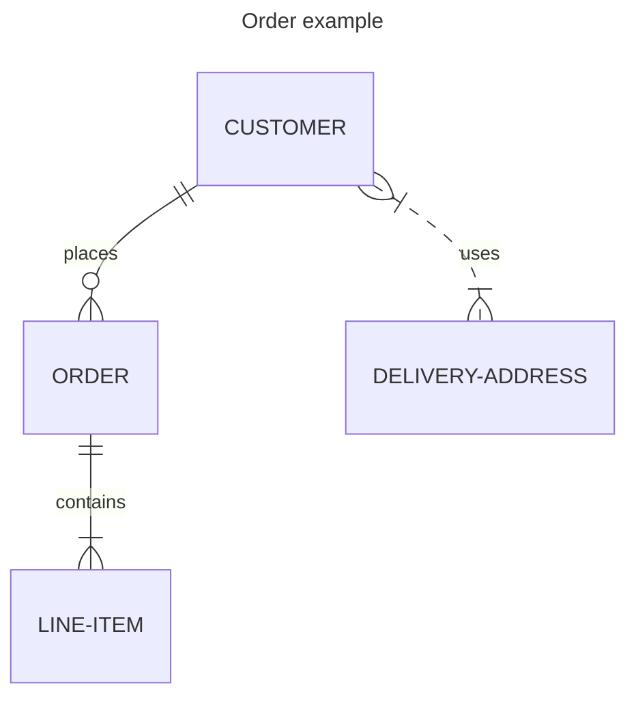

實體名稱通常使用大寫，儘管這方面沒有公認的標準，而且在 Mermaid 中也不是必需的。

實體之間的關係由帶有表示基數的末端標記的線條表示。 Mermaid 使用最流行的鴉足（crow's foot）符號。鴉足直觀地傳達了它所連接的實體可能有多個實例的可能性。

ER 圖可用於各種目的，從不含任何實現細節的抽象邏輯模型，到關係型資料庫表的物理模型。在 ER 圖中包含屬性定義有助於理解實體的目的和含義。這些定義不一定需要詳盡；通常一小部分屬性就足夠了。 Mermaid 允許按照屬性的類型和名稱來定義它們。

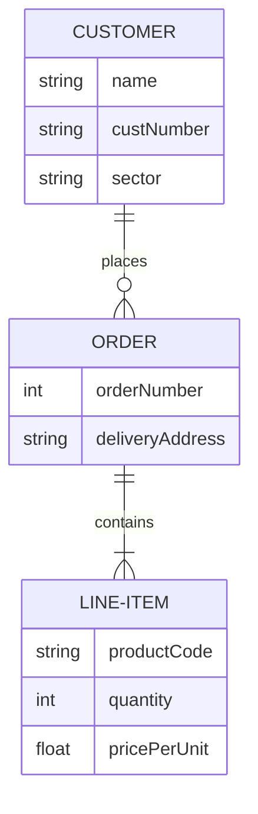

在ER圖中包含屬性時，您必須決定是否將外鍵作為屬性包括在內。這可能取決於您嘗試表示關係型表結構的程度。如果您的圖是不意味著關係型實現的邏輯模型，那麼最好將外鍵排除在外，因為關聯關係已經傳達了實體之間關聯的方式。例如，JSON資料結構可以使用陣列實現一對多關係，而不需要外鍵屬性。同樣，面向對象的程式設計語言可能使用指針或集合引用。即使是針對關係型實現的模型，您也可能認為包含外鍵屬性會重複關係已經描述的信息，而不會為實體增加意義。最終，這是您自己的選擇。

## 語法

### 實體和關係

 Mermaid 的ER圖語法與PlantUML兼容，並擴展了關係標籤。每個語句由以下部分組成：

```
    <first-entity> [<relationship> <second-entity> : <relationship-label>]
```

其中：

- `first-entity`是實體的名稱。名稱支持任何Unicode字元，如果包含空格，可以用雙引號括起來（例如"name with space"）。
- `relationship`描述了兩個實體相互關聯的方式。見下文。
- `second-entity`是另一個實體的名稱。
- `relationship-label`從第一個實體的角度描述關係。

例如：

```
    PROPERTY ||--|{ ROOM : contains
```

這個語句可以理解為：一個物業包含一個或多個房間，而一個房間是且僅是一個物業的一部分。您可以看到，這裡的標籤是從第一個實體的角度出發的：一個物業包含一個房間，而房間不包含物業。從第二個實體的角度考慮時，等效的標籤通常很容易推斷。（有些ER圖從兩個角度標記關係，但這裡不支持這種做法，而且通常是多餘的）。

一個語句中只有`first-entity`部分是必須的。這使得可以顯示沒有關係的實體，這在迭代構建圖表時可能很有用。如果指定了語句的任何其他部分，則所有部分都是必須的。

#### Unicode文字

實體名稱、關係和屬性都支援Unicode文字。

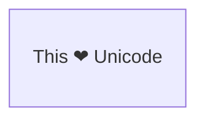

#### Markdown格式

也支援Markdown格式和文字。

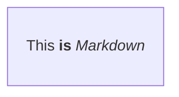

### 關係語法

每個語句的`relationship`部分可以分解為三個子組件：

- 第一個實體相對於第二個實體的基數
- 關係是否賦予「子」實體身份識別
- 第二個實體相對於第一個實體的基數

基數是一個描述有多少另一個實體的元素可以與所討論的實體相關聯的屬性。在上面的例子中，一個`PROPERTY`（物業）可以有一個或多個與之關聯的`ROOM`（房間）實例，而一個`ROOM`只能與一個`PROPERTY`關聯。在每個基數標記中有兩個字符。最外面的字符表示最大值，最內層的字符表示最小值。下表總結了可能的基數。

| 值（左） | 值（右） | 含義                  |
| :------: | :------: | --------------------- |
|   `\|o`   |   `o\|`   | 零或一                |
|  `\|\|`  |  `\|\|`  | 恰好一個              |
|   `}o`   |   `o{`   | 零或多個（無上限）    |
|   `}\|`   |   `\|{`   | 一個或多個（無上限）  |

**別名**

| 值（左）  | 值（右）  | 別名於      |
| :-------: | :-------: | ------------ |
| one or zero  | one or zero  | 零或一      |
| zero or one  | zero or one  | 零或一      |
| one or more  | one or more  | 一個或多個  |
| one or many  | one or many  | 一個或多個  |
|   many(1)    |    many(1)    | 一個或多個  |
|      1+      |      1+       | 一個或多個  |
| zero or more | zero or more  | 零或多個    |
| zero or many | zero or many  | 零或多個    |
|   many(0)    |    many(0)    | 零或多個    |
|      0+      |      0+       | 零或多個    |
|   only one   |   only one    | 恰好一個    |
|      1       |       1       | 恰好一個    |

### 識別關係

關係可以分為識別關係或非識別關係，它們分別用實線或虛線表示。當一個實體沒有另一個實體就無法獨立存在時，這一點很重要。例如，一家為人們提供汽車駕駛保險的公司可能需要存儲`NAMED-DRIVER`（指定駕駛員）的資料。在建模時，我們可能首先觀察到一輛`CAR`（汽車）可以由多個`PERSON`（人）實例駕駛，而一個`PERSON`可以駕駛多輛`CAR` - 這兩個實體都可以在沒有對方的情況下存在，因此這是一種非識別關係，我們可能在 Mermaid 中指定為：`PERSON }|..|{ CAR : "driver"`。請注意關係中間的兩個點，它們將導致在兩個實體之間繪製虛線。但是當這種多對多關係被解析為兩個一對多關係時，我們觀察到一個`NAMED-DRIVER`如果沒有`PERSON`和`CAR`就不能存在 - 關係變成識別關係，並使用連字符指定，這會轉換為實線：

| 值  |      別名於       |
| :--: | :---------------: |
|  --  |     _識別關係_     |
|  ..  |    _非識別關係_    |

**別名**

|     值      |      別名於       |
| :---------: | :---------------: |
|      to       |     _識別關係_     |
| optionally to |    _非識別關係_    |

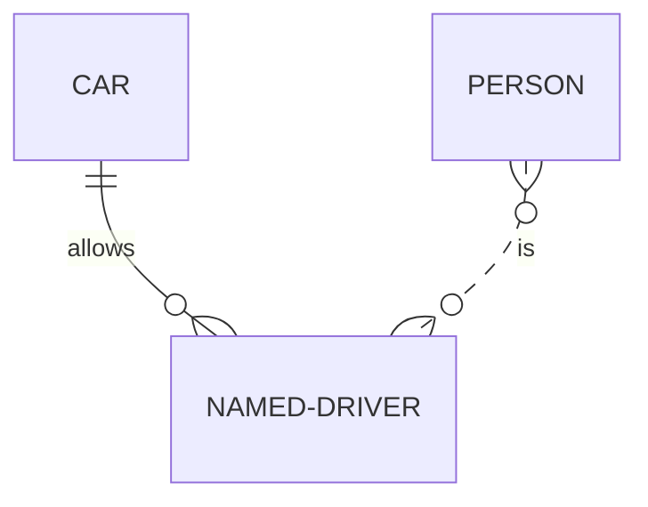


### 屬性

可以為實體定義屬性，方法是指定實體名稱，然後用一個包含多個`type name`對的區塊，其中區塊由開始的`{`和結束的`}`界定。屬性在實體框內渲染。例如：

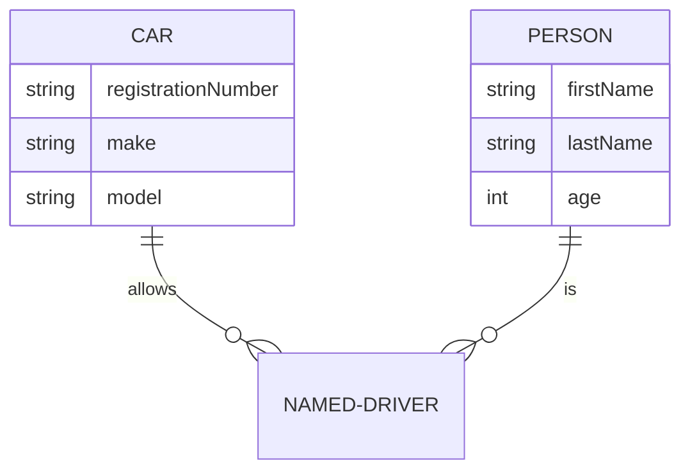

`type`值必須以字母字符開頭，可以包含數字、連字符、下劃線、括號和方括號。`name`值遵循與`type`類似的格式，但可以以星號開頭，作為表示屬性是主鍵的另一個選項。除此之外，沒有其他限制，也沒有隱含的有效資料類型集。

### 實體名稱別名

可以使用方括號為實體添加別名。如果提供了別名，圖表中將顯示別名而不是實體名稱。別名名稱遵循與實體名稱相同的所有規則。

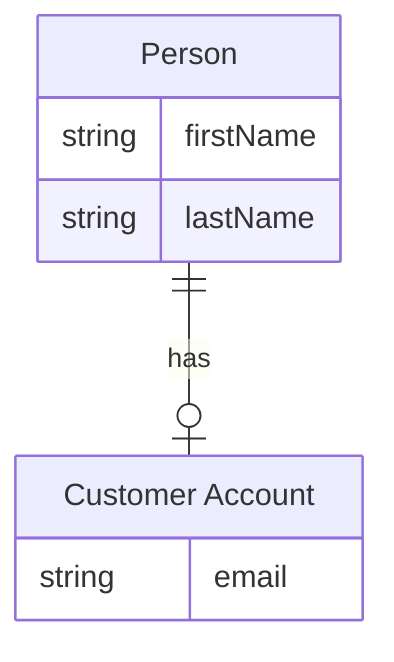

#### 屬性鍵和註釋

屬性還可以定義`key`或註釋。鍵可以是`PK`、`FK`或`UK`，分別表示主鍵、外鍵或唯一鍵（鍵不支持Markdown格式和Unicode）。要在單個屬性上指定多個鍵約束，請用逗號分隔（例如，`PK, FK`）。`comment`由屬性末尾的雙引號定義。註釋本身不能包含雙引號字符。

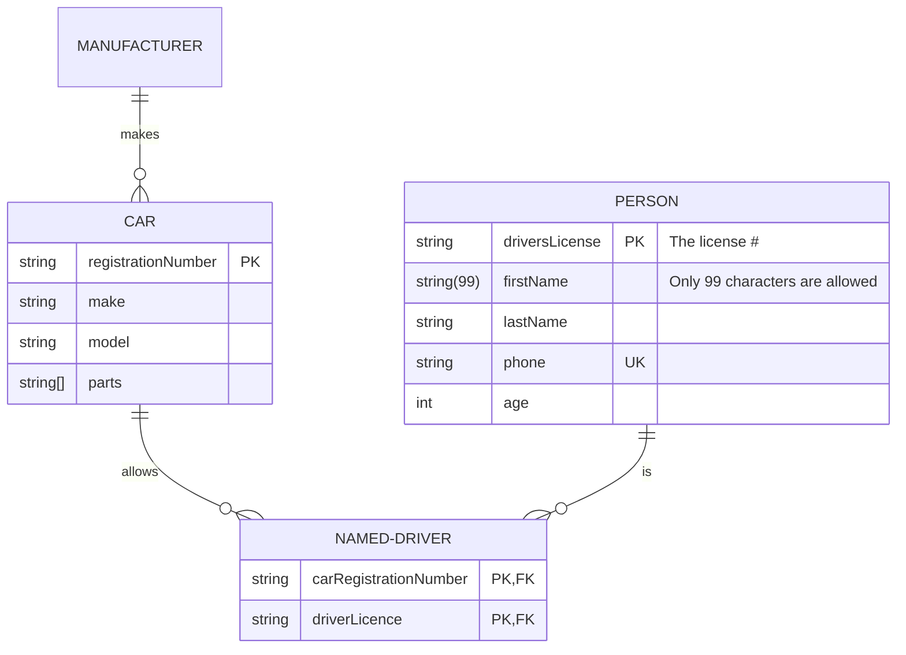

### 方向

direction語句聲明圖表的方向。

這宣告了圖表是從上到下（`TB`）定向的。這可以反轉為從下到上（`BT`）定向。


這宣告了圖表是從左到右（`LR`）定向的。這可以反轉為從右到左（`RL`）定向。

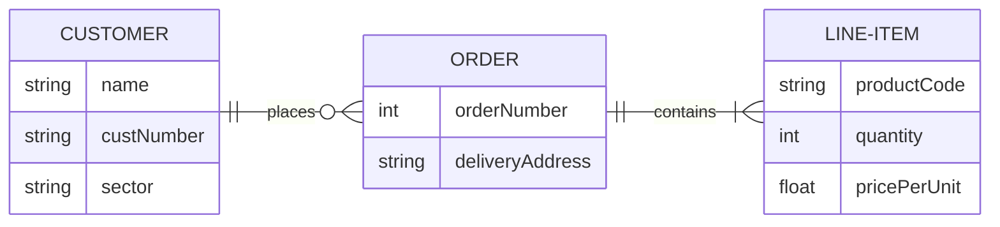

可能的圖表方向有：

- TB - 從上到下
- BT - 從下到上
- RL - 從右到左
- LR - 從左到右

### 節點樣式

可以對節點應用特定樣式，如更粗的邊框或不同的背景顏色。

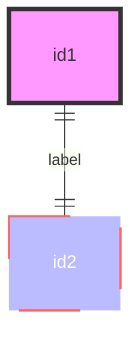

也可以在一個語句中將樣式附加到多個節點：

```
    style nodeId1,nodeId2 styleList
```

#### 類別

比每次定義樣式更方便的是定義一個樣式類別，並將該類別附加到應該有不同外觀的節點。

類別定義看起來像下面的例子：

```
    classDef className fill:#f9f,stroke:#333,stroke-width:4px
```

也可以在一個語句中定義多個類別：

```
    classDef firstClassName,secondClassName font-size:12pt
```

類別附加到節點的方式如下：

```
    class nodeId1 className
```

也可以在一個語句中將類別附加到多個節點：

```
    class nodeId1,nodeId2 className
```

也可以同時附加多個類別：

```
    class nodeId1,nodeId2 className1,className2
```

添加類別的更簡短的形式是使用`:::`操作符將類別名稱附加到節點，如下所示：

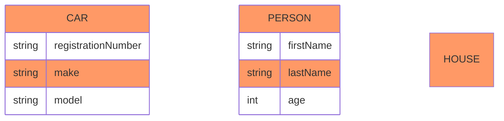

這種形式可以在聲明實體之間的關係時使用：

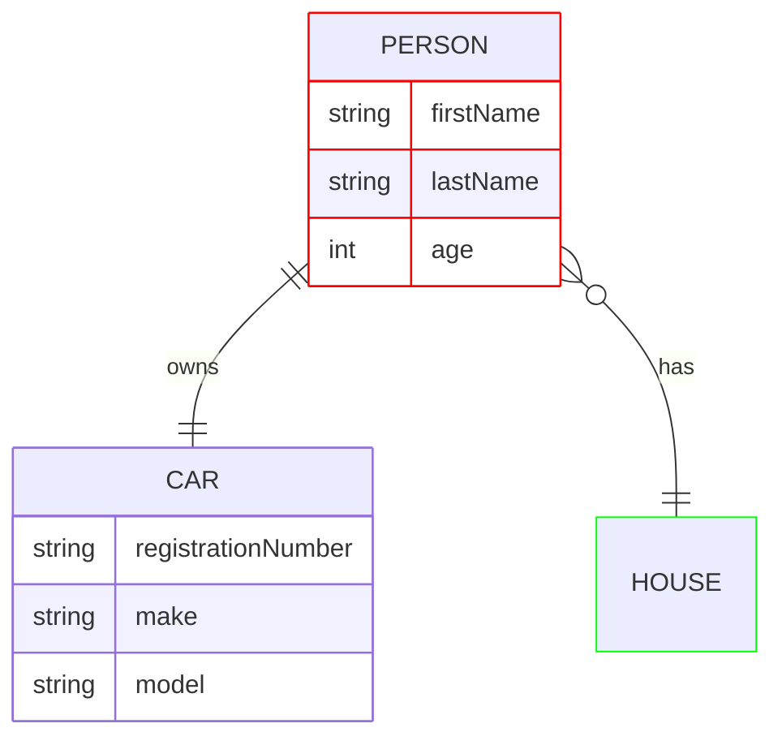

與class語句類似，簡短語法也可以一次應用多個類別：

```
    nodeId:::className1,className2
```

### 默認類別

如果一個類別被命名為default，它將被分配給所有沒有特定類別定義的類別。

```
    classDef default fill:#f9f,stroke:#333,stroke-width:4px;
```

> **注意：** 來自style或其他類別語句的自定義樣式優先，並會覆蓋默認樣式。（例如，`default`類別給節點一個粉紅色的背景，但如果應用了`blue`類別，該節點將具有藍色背景。）

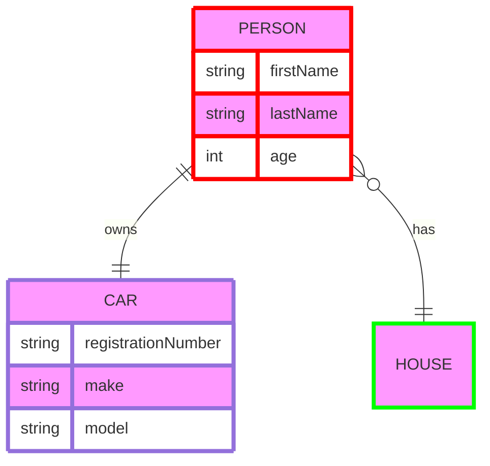

## 配置

### 布局

圖表的布局由[`render()`](../config/setup/mermaid/interfaces/Mermaid.md#render)處理。默認布局是dagre。

對於更大或更複雜的圖表，您可以使用YAML前言的`config`來應用替代的ELK（Eclipse Layout Kernel）布局。有關更多信息，請參見[自定義ELK布局](../intro/syntax-reference.md#customizing-elk-layout)。

```yaml
---
config:
  layout: elk
---
```

您的Mermaid代碼應類似於以下內容：

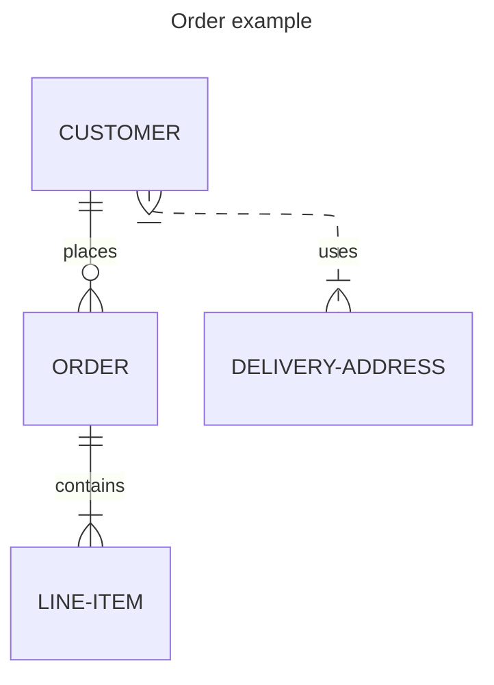

```note
請注意，網站需要使用mermaid 9.4+版本才能使此功能工作，並在延遲加載配置中啟用此功能。
```

<!--- cspell:locale en,en-gb --->