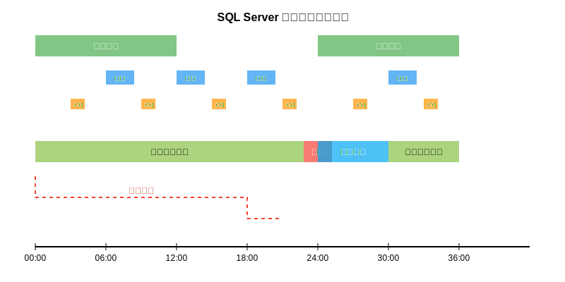

# SQL Server 的三種復原模式說明

SQL Server 提供了三種不同的復原模式（Recovery Models），每種模式在資料復原能力、備份策略和性能影響方面各有特點。以下是詳細說明和實際案例。

## 1. 完整復原模式（Full Recovery Model）

### 特點
- 記錄所有交易詳細資訊
- 支援時間點還原（Point-in-time Recovery）
- 需要定期進行交易日誌備份
- 可還原至交易日誌備份中的任何時間點

### 視覺化案例

**資料變更時間線**：
```
|-------|-------|-------|-------|-------|-------|-------|-------|
8:00    9:00    10:00   11:00   12:00   13:00   14:00   15:00
  ↑       ↑                ↑                ↑     ↑ 
完整備份  交易    系統錯誤    交易日誌     交易   硬碟故障
         日誌備份           備份          日誌備份
```

若在 15:00 發生硬碟故障，可以：
1. 還原 8:00 的完整備份
2. 應用 10:00 的交易日誌備份
3. 應用 13:00 的交易日誌備份
4. 從最後一個日誌備份還原至故障前的任意時間點

### 實際應用案例
**金融交易系統**：銀行的核心交易系統必須記錄每一筆交易，在系統故障時不能有任何資料遺失。使用完整復原模式，可以確保交易資料的完整性，並能還原至任何時間點的狀態。

## 2. 簡單復原模式（Simple Recovery Model）

### 特點
- 自動截斷交易日誌
- 僅支援備份點還原，不支援時間點還原
- 交易日誌備份無效
- 系統負擔較小

### 視覺化案例

**資料變更時間線**：
```
|-------|-------|-------|-------|-------|-------|-------|-------|
8:00    9:00    10:00   11:00   12:00   13:00   14:00   15:00
  ↑               ↑                ↑              ↑ 
完整備份          完整備份          完整備份        硬碟故障
```

若在 15:00 發生硬碟故障，只能：
1. 還原至最近的 13:00 完整備份
2. 13:00 至 15:00 之間的交易資料將全部遺失

### 實際應用案例
**開發和測試環境**：非生產環境通常不需要時間點還原能力，開發人員更關注系統效能和磁碟空間使用。簡單復原模式避免了交易日誌佔用過多空間，適合頻繁變更的開發環境。

## 3. 大量記錄復原模式（Bulk-logged Recovery Model）

### 特點
- 大多數操作與完整復原模式相同
- 大量操作（Bulk operations）僅記錄最少日誌
- 部分支援時間點還原，但大量操作期間受限
- 適合大量資料載入操作

### 視覺化案例

**資料變更時間線**：
```
|-------|-------|-------|-------|-------|-------|-------|-------|
8:00    9:00    10:00   11:00   12:00   13:00   14:00   15:00
  ↑       ↑       ↑       ↑       ↑                ↑ 
完整備份  交易     大量     交易    交易日誌         硬碟故障
         日誌備份  資料    日誌備份  備份
                  載入
```

若在 15:00 發生硬碟故障：
1. 可還原至 8:00 的完整備份
2. 應用 9:00 的交易日誌備份
3. 無法還原至大量資料載入操作期間的具體時間點
4. 可應用 11:00 和 13:00 的交易日誌備份

### 實際應用案例
**資料倉儲環境**：資料倉儲經常需要進行大量資料載入操作，如果使用完整復原模式，這些操作會產生巨大的交易日誌。使用大量記錄復原模式，可以在大幅提高大量載入效能的同時，仍保持大部分復原能力。

## 三種模式比較表

| 特性 | 完整復原 | 簡單復原 | 大量記錄復原 |
|------|---------|---------|------------|
| 資料遺失風險 | 最低 | 最高 | 中等 |
| 時間點還原 | 完全支援 | 不支援 | 部分支援 |
| 交易日誌空間需求 | 高 | 低 | 中等 |
| 管理複雜度 | 高 | 低 | 中等 |
| 適用場景 | 生產/關鍵系統 | 開發/測試環境 | 大量資料處理系統 |

## 選擇建議

1. **完整復原模式**：用於不能接受資料遺失的業務關鍵資料庫
2. **簡單復原模式**：用於資料可重建或資料遺失影響較小的系統
3. **大量記錄復原模式**：用於需要定期進行大量資料操作且仍需一定復原能力的系統

設定復原模式可通過 SSMS 或 T-SQL 進行：

```sql
ALTER DATABASE DatabaseName SET RECOVERY FULL; -- 完整復原模式
ALTER DATABASE DatabaseName SET RECOVERY SIMPLE; -- 簡單復原模式
ALTER DATABASE DatabaseName SET RECOVERY BULK_LOGGED; -- 大量記錄復原模式
```

選擇合適的復原模式應根據業務需求、可接受的資料遺失範圍和系統資源綜合考量。

# SQL Server 2022 備份類型

SQL Server 2022 提供多種備份類型，以滿足不同的資料保護需求和復原策略。以下是詳細說明：

## 1. 完整備份 (Full Backup)

**定義**：完整備份包含整個資料庫的所有資料以及足夠的日誌記錄，使資料庫能夠復原至備份時的狀態。

**特點**：
- 是所有復原策略的基礎
- 包含備份時資料庫的完整快照
- 備份完成後不會截斷交易日誌
- 可獨立於其他備份使用

**語法範例**：
```sql
BACKUP DATABASE AdventureWorks
TO DISK = 'D:\Backups\AdventureWorks_Full.bak'
WITH COMPRESSION, CHECKSUM;
```

## 2. 差異備份 (Differential Backup)

**定義**：差異備份包含自最後一次完整備份後發生變更的所有資料頁面。

**特點**：
- 比完整備份小且快
- 隨著與完整備份時間間隔增加而變大
- 恢復時需要最近的完整備份和一個差異備份
- 不會截斷交易日誌

**語法範例**：
```sql
BACKUP DATABASE AdventureWorks
TO DISK = 'D:\Backups\AdventureWorks_Diff.bak'
WITH DIFFERENTIAL, COMPRESSION, CHECKSUM;
```

## 3. 交易日誌備份 (Transaction Log Backup)

**定義**：備份自上次日誌備份後記錄的所有交易日誌記錄。

**特點**：
- 允許時間點復原
- 只在完整或大量記錄恢復模式下可用
- 備份後會截斷已備份的日誌
- 可減少日誌檔案大小

**語法範例**：
```sql
BACKUP LOG AdventureWorks
TO DISK = 'D:\Backups\AdventureWorks_Log.trn'
WITH COMPRESSION, CHECKSUM;
```

## 4. 複製備份 (Copy-Only Backup)

**定義**：不影響正常備份序列的特殊完整或日誌備份。

**特點**：
- 不會重設差異基準點
- 不影響日誌鏈
- 不會截斷交易日誌
- 適用於額外備份而不影響既定備份計劃

**語法範例**：
```sql
BACKUP DATABASE AdventureWorks
TO DISK = 'D:\Backups\AdventureWorks_CopyOnly.bak'
WITH COPY_ONLY, COMPRESSION, CHECKSUM;
```

## 5. 部分備份 (Partial Backup)

**定義**：備份主要檔案群組、所有可讀寫檔案群組和指定的唯讀檔案群組。

**特點**：
- 可減少備份大小和時間
- 適用於有唯讀檔案群組的大型資料庫
- 僅備份活躍的資料部分

**語法範例**：
```sql
BACKUP DATABASE AdventureWorks
FILEGROUP = 'PRIMARY',
FILEGROUP = 'ActiveData'
TO DISK = 'D:\Backups\AdventureWorks_Partial.bak'
WITH COMPRESSION;
```

## 6. 檔案或檔案群組備份 (File or Filegroup Backup)

**定義**：只備份資料庫中的特定檔案或檔案群組。

**特點**：
- 適用於超大型資料庫
- 可針對重要或常變更的部分進行更頻繁的備份
- 需要額外的日誌備份來支援復原

**語法範例**：
```sql
BACKUP DATABASE AdventureWorks
FILE = 'AdventureWorks_Data'
TO DISK = 'D:\Backups\AdventureWorks_File.bak'
WITH COMPRESSION;
```

## 7. 差異部分備份 (Differential Partial Backup)

**定義**：備份自上次部分備份後變更的資料頁面。

**特點**：
- 部分備份的差異版本
- 只包含自上次部分備份後變更的資料頁面
- 可顯著減少備份大小和時間

**語法範例**：
```sql
BACKUP DATABASE AdventureWorks
FILEGROUP = 'PRIMARY',
FILEGROUP = 'ActiveData'
TO DISK = 'D:\Backups\AdventureWorks_PartialDiff.bak'
WITH DIFFERENTIAL, COMPRESSION;
```

## SQL Server 2022 新增的備份功能

- **Azure Blob 存儲目標的加密備份**：支援更安全的雲端備份
- **S3 相容存儲的直接備份**：支援 AWS S3 等雲端存儲
- **壓縮改進**：更高效的壓縮演算法
- **資料庫快照備份**：針對 Azure 存儲提供更快速的備份選項
- **系統資料庫備份改進**：更好的系統資料庫備份支援

根據資料庫大小、可用維護窗口、復原時間目標和復原點目標，可設計結合多種備份類型的完整備份策略，實現最佳的資料保護方案。


---

# SQL Server 2022 備份類型視覺化說明

## 備份類型與關係



如上方流程圖所示，SQL Server 2022 提供七種主要備份類型，每種類型有不同的用途和特點。為了進一步說明各種備份類型如何共同工作，請看以下視覺化案例：

## 常見備份策略視覺化

### 完整-差異-日誌 混合策略

這是企業環境中最常見的備份策略，如上方甘特圖所示：

1. **完整備份**：每 24 小時執行一次（凌晨）
2. **差異備份**：每 6 小時執行一次
3. **交易日誌備份**：每 3 小時執行一次

當系統在第 22 小時發生故障時，恢復過程如下：
- 還原最近的完整備份（第 0 小時）
- 還原最近的差異備份（第 18 小時）
- 依序還原之後的交易日誌備份（第 21 小時）

這種策略平衡了備份效能和恢復能力，對於大多數業務關鍵系統非常適用。

### 大型資料庫策略視覺化

對於超大型資料庫，可使用檔案群組和部分備份來優化備份性能：

```
週日: 完整備份
|
├── 週一: 檔案群組備份 (常用資料)
|   ├── 交易日誌備份 (每小時)
|   └── 差異備份 (中午)
|
├── 週二: 檔案群組備份 (常用資料)
|   ├── 交易日誌備份 (每小時)
|   └── 差異備份 (中午)
...
```

## 各備份類型使用場景視覺化

1. **完整備份**
   ```
   [整個資料庫] ────────> [.bak 檔案]
   ```
   適用場景：小型資料庫、週末完整備份、初始備份

2. **差異備份**
   ```
   [變更的資料頁] ─────> [.bak 檔案]
   ```
   適用場景：工作日增量備份、減少還原時間

3. **交易日誌備份**
   ```
   [交易日誌記錄] ─────> [.trn 檔案]
   ```
   適用場景：實現最小資料丟失、關鍵業務系統

4. **複製備份**
   ```
   [整個資料庫] ──複製──> [.bak 檔案]
                 │
   [正常備份鏈] ─不受影響─┘
   ```
   適用場景：測試環境複製、不中斷正常備份鏈

5. **部分備份**
   ```
   [主要檔案群組] ─┐
   [讀寫檔案群組] ─┼─> [.bak 檔案]
                  │
   [唯讀檔案群組] ─┘
   (選擇性備份)
   ```
   適用場景：包含歷史資料的大型資料庫

## 備份類型決策樹

```
開始評估 ──> 資料庫大小? ──> 小型 ──> 完整備份
              │                       │
              │                       └─> 需時間點恢復? ──> 是 ──> +交易日誌備份
              │                                          │
              │                                          └─> 否 ──> 簡單復原模式
              │
              └─> 大型 ──> 是否有唯讀檔案群組? ──> 是 ──> 部分備份
                     │                         │
                     │                         └─> +差異部分備份
                     │
                     └─> 否 ──> 可接受停機時間? ──> 短 ──> 檔案群組備份
                                               │
                                               └─> 長 ──> 完整+差異備份
```

通過這些視覺化說明，可以更清楚地理解不同備份類型的用途和它們如何協同工作，以建立有效的資料庫備份和恢復策略。選擇適當的備份類型和頻率應基於以下因素：

- 復原時間目標 (RTO)
- 復原點目標 (RPO)
- 可用系統資源
- 維護時段長度
- 資料庫大小和活動性

SQL Server 2022 的多種備份類型提供了彈性的選擇，可以根據不同環境需求設計最佳的數據保護方案。