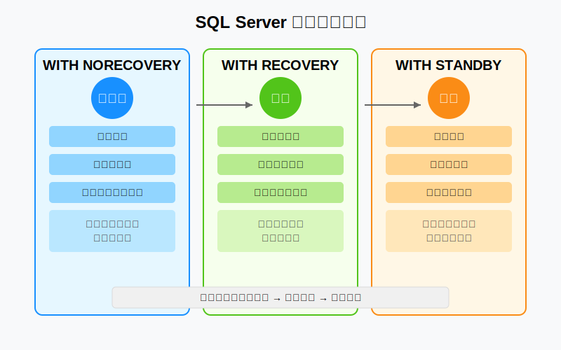
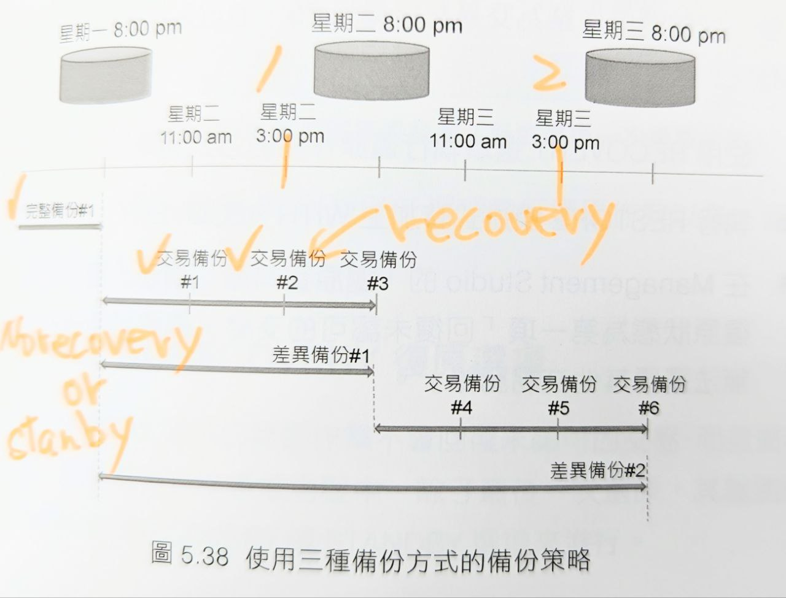

# SQL Server 復原選項比較：NORECOVERY, RECOVERY 與 STANDBY

這三種復原選項決定了在還原操作完成後資料庫的狀態和可用性。以下是它們的說明和比較：

## 三種復原選項詳解

### WITH NORECOVERY
- 資料庫在還原後處於「還原中」狀態
- 不允許使用者存取資料庫
- 交易日誌**不會回滾未完成的交易**
- 允許繼續還原其他備份（差異備份、日誌備份）
- 主要用於多階段還原過程的中間步驟


>**為什麼需要這個狀態？**
>
>想像還原過程像是搭建一棟樓房：
>
>- 完整備份是地基和基本結構
>- 差異備份是加上幾層樓
>- 交易日誌備份是最終的細節和裝飾
>
>如果在完成地基後就「開放樓房使用」(WITH RECOVERY)，您將無法繼續建造剩餘部分。保持「還原狀態」(WITH NORECOVERY) 就像告訴系統「我們還沒完成建造，請勿使用」。


### WITH RECOVERY（預設選項）
- 資料庫在還原後處於「完全可操作」狀態
- 允許使用者完全存取資料庫
- 回滾所有未完成的交易以達到一致性狀態
- 結束還原序列，**不能再繼續還原其他備份**
- **通常用於還原序列的最後一步**

### WITH STANDBY
- 資料庫處於唯讀狀態
- 允許使用者讀取資料庫資料
- 可以繼續還原其他備份
- 建立「撤銷檔案」以記錄未完成交易的狀態
- 常用於建立報表伺服器或備用伺服器

## 視覺化比較


## 實際應用場景



### WITH NORECOVERY 使用場景
```sql
-- 還原完整備份，保持資料庫處於還原狀態
RESTORE DATABASE Northwind 
FROM DISK = 'C:\Backup\Northwind_Full.bak' 
WITH NORECOVERY;

-- 接著還原差異備份
RESTORE DATABASE Northwind 
FROM DISK = 'C:\Backup\Northwind_Diff.bak' 
WITH NORECOVERY;

-- 最後還原交易日誌備份
RESTORE LOG Northwind 
FROM DISK = 'C:\Backup\Northwind_Log.trn' 
WITH RECOVERY; -- 最後一步使用 RECOVERY
```

### WITH RECOVERY 使用場景
```sql
-- 單階段還原，完成後資料庫立即可用
RESTORE DATABASE Northwind 
FROM DISK = 'C:\Backup\Northwind_Full.bak' 
WITH RECOVERY; -- 或省略，因為 RECOVERY 是預設選項
```

### WITH STANDBY 使用場景
```sql
-- 還原資料庫並使其處於唯讀狀態
RESTORE DATABASE Northwind 
FROM DISK = 'C:\Backup\Northwind_Full.bak' 
WITH STANDBY = 'C:\Temp\undo_file.tuf';

-- 此時可以查詢資料庫，然後繼續還原
RESTORE LOG Northwind 
FROM DISK = 'C:\Backup\Northwind_Log.trn' 
WITH STANDBY = 'C:\Temp\undo_file.tuf';
```

## 選擇指南

- 使用 **NORECOVERY**：當執行多階段還原過程中的任何步驟（除了最後一步）
- 使用 **RECOVERY**：當還原過程完成，需要立即讓資料庫可操作
- 使用 **STANDBY**：當需要在還原過程中檢查資料狀態，或建立可讀的次要伺服器

透過這些不同的復原選項，您可以根據業務需求靈活地控制資料庫還原過程和可用性。