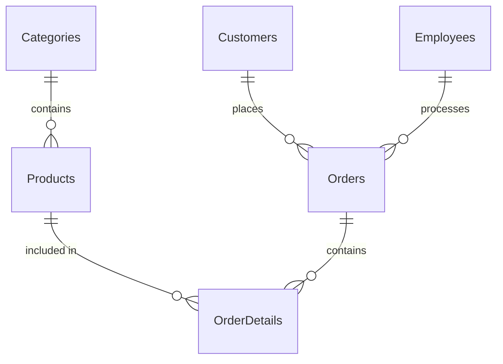

# 建立一家小型3C零售公司設計銷售資料庫系統。

## 1. 銷售資料庫ER模型設計



## 2. SQL Server 2022 資料表建立語法

以下是使用SQL Server 2022語法建立資料庫和相關表的SQL指令：

```sql
-- 創建資料庫
CREATE DATABASE Electronics3CStore;
GO

USE Electronics3CStore;
GO

-- 創建產品類別表
CREATE TABLE Categories (
    
);

-- 創建產品表
CREATE TABLE Products (
   
);

-- 創建客戶表
CREATE TABLE Customers (
   
);

-- 創建員工表
CREATE TABLE Employees (
   
);

-- 創建訂單表
CREATE TABLE Orders (
    
);

-- 創建訂單明細表
CREATE TABLE OrderDetails (
   
);

```

## 3. 新增產品類別與產品資料

```sql
-- 建立產品類別

-- 建立產品資料

-- 智慧型手機

-- 平板電腦

-- 桌上型電

-- 顯示器

```

## 4. 新增客戶和員工資料

```sql
-- 建立客戶資料

-- 建立員工資料


```

## 5. 生成銷售記錄

```sql
-- 建立訂單資料

-- 建立訂單明細資料


```

## 6. 查詢資料驗證

您可以使用以下SQL查詢來驗證資料庫的建立和資料的建立是否成功：

```sql
-- 查詢所有產品類別


-- 查詢所有產品


-- 查詢所有訂單及總金額


-- 查詢訂單明細


-- 計算每個產品類別的銷售總額


-- 查找最暢銷的產品


```

新增了5個產品類別、20個產品、5個客戶、3個員工和10筆訂單記錄(含訂單明細)。
